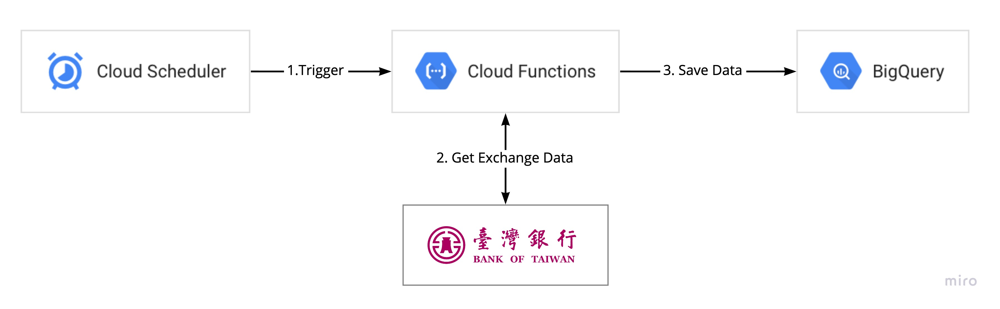

# Taiwan Exchange Rate Sample

透過台銀匯率的小程式，整合 Cloud Functions + Cloud Scheduler + BigQuery

Flow chart


## Setup GCP

### 設定 GCP_PROJECT_ID 環境變數，方便後面操作使用
```
GCP_PROJECT_ID=<gcp_project_id>
```

### 設定 BigQuery ServiceAccount 並下載 json key
```
gcloud iam service-accounts create bigquery \
  --description="BigQuery" --display-name="bigquery"

gcloud projects add-iam-policy-binding ${GCP_PROJECT_ID} \
    --member="serviceAccount:bigquery@${GCP_PROJECT_ID}.iam.gserviceaccount.com" \
    --role="roles/bigquery.admin"

gcloud iam service-accounts keys create ~/bigquery.json \
    --iam-account bigquery@${GCP_PROJECT_ID}.iam.gserviceaccount.com
```

## Setup Python

```
pip install -r requirements.txt
```

## Test in local

```
export GOOGLE_APPLICATION_CREDENTIALS=<gcp_bigquery_credential_json>
python main.py
```

## Deploy to Cloud Functions

```
gcloud functions deploy exchange_rate --runtime python37 --trigger-http --region=asia-northeast1 --allow-unauthenticated
```

## Setup Cloud Scheduler

```
gcloud scheduler jobs create http exchange_rate_scheduler --schedule "0 20 * * *" --uri "https://asia-northeast1-<project_id>.cloudfunctions.net/exchange_rate" --http-method GET --time-zone=Asia/Taipei
```

## Clean

```
# Remove Scheduler
gcloud scheduler jobs delete exchange_rate_scheduler

# Remove Cloud Functions
gcloud functions delete exchange_rate --region=asia-northeast1

# remove BigQuery
gcloud alpha bq datasets delete taiwan_exchange_rate --remove-tables
```


## Copyright / License
* Copyright (c) 2020 Cloud Ace
* Licensed under [MIT](LICENSE) licenses.
